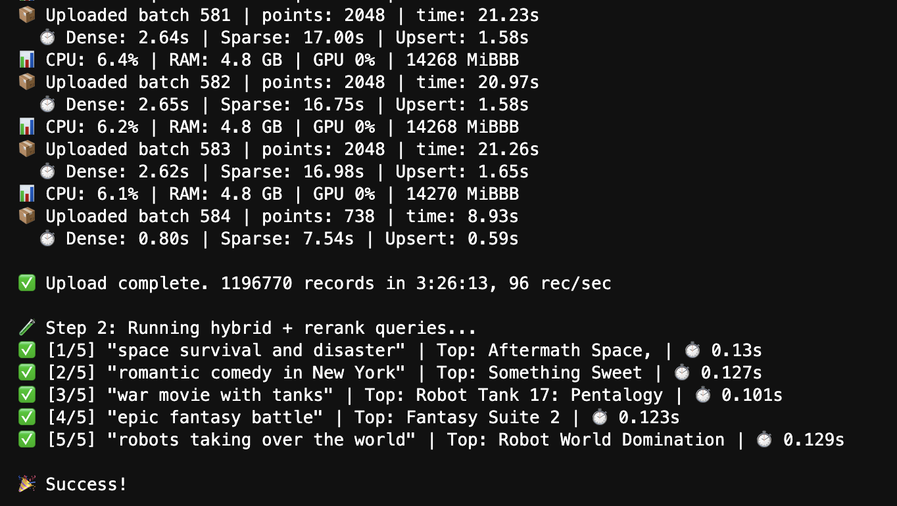
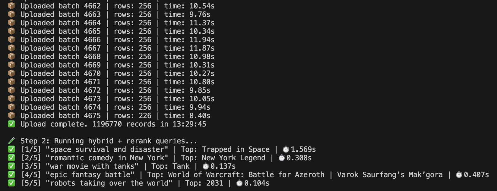

# 🎬 Hybrid Search System for Movie Dataset

This project implements a modular hybrid search pipeline on a 1M-row TMDB movie dataset using Qdrant as the vector database. It combines dense (semantic), sparse (keyword), and reranking techniques to provide high-quality, user-specific search results.

High-level, the code covers 3 scenarios (check out the demo video for more info):
- test pipeline on 3,000 dataset records to test end-to-end code (local database,localhost:6333)
- full pipeline on 1.2M records which takes several hours to load depending on your compute (production database on EC2 machine, localhost:8333)
- search notebook to provide bare-bones UX (configured to run on 1.2M records)


## 🚀 Features

- **Dense Vector Search** — using SentenceTransformers (`all-MiniLM-L6-v2`)
- **Sparse Retrieval (BM25-like)** — using SPLADE from FastEmbed
- **Hybrid Fusion** — combining dense & sparse using Reciprocal Rank Fusion (RRF)
- **Late Interaction Reranking** — with multilingual Jina cross-encoder
- **Per-user Filtering** — all results are filtered by a synthetic `user_id`
- **Visualization & Logging** — latency and score histograms, JSONL logs
- **Interactive UI** — via Jupyter widgets in `main_interface.ipynb`


---
## 📽️ Demo

[Short Demo Recording](hybridsearch_demo.mp4) 
- 00:00-00:12 - test pipeline on local test database
- 00:12-00:18 - full pipeline on production database
- 00:18-00:42 - search notebook

## 🧱 Project Structure
```text
project-root/
│
├── src/
│   ├── config.py                           ← 📦 Loads YAML config
│   ├── data_preparation.py                 ← 📤 Upload dataset to Qdrant
│   ├── evaluation.py                       ← 🧪 Query execution & logging
│   ├── hybrid_search.py                    ← 🔍 Dense + sparse + RRF
│   ├── reranker.py                         ← ⚖️ CrossEncoder reranking
│   └── visualize.py                        ← 📊 Matplotlib-based plotters (optiolal)
├── data/
│   ├── TMDB_movie_dataset_v11_small.csv    ← 📦 Test dataset 3,000 records
│   ├── TMDB_movie_dataset_v11.csv          ← ❌ too big for github, shared on dropbox, link below
│   └── movies_backup.json                  ← ❌ too big for github, shared on dropbox, link below
│
├── config.yaml                             ← ⚙️ Central config (models, paths, params)
├── requirements.txt                        ← 📦 Reproducibility
├── README.md                               ← 📘 How to run, overview
└── main_interface.ipynb                    ← 📓 Central interactive notebook (user input, demo)
```
---

## 🧪 Quickstart

### 1. Install dependencies (Python 3.10+)
```bash
python -m venv .venv
source .venv/bin/activate
pip install -r requirements.txt
```
### 2. Start Qdrant locally
```bash
docker-compose up -d
docker ps
docker logs qdrant-node1 -f
curl http://localhost:6333/cluster | jq

docker-compose down -v
```
Compose file: `deployment/docker-compose.yml`

### 3. Run the test pipeline. 3000 records takes ~4 min
```bash
python 0_test_pipeline.py
```
### 4. Run the complete pipeline. 1.2M records takes several hours depending on your compute
Download the dataset and update dataset_path in the config 
```bash
python 1_complete_pipeline.py
```
⏱️ Complete Pipeline run on g6.4xlarge, GPU enabled, 1.2M in 3.5 hours:



⏱️ Complete Pipeline run on Apple M3 Pro, 1.2M in 13.5 hours:



### 4. Explore the results interactively
Run search queries interactively in Jupyter Notebook
```bash
jupyter notebook 2_Main_Notebook.ipynb
```

### ⚙️ Configuration
Key options in `config.yaml`
`collection_name:`
`batch_size:`

`embedding_models:`

`qdrant:` - database endpoint

`dataset_path:`
`rows:` - set to desired number of rows i.e. 1000 for dev-mode. by default the complete pipeline will read the entire file.

### 📁 Dataset
- ✅ 3000 row sample included in the distribution - data folder
- 📂 [Full dataset in CSV](https://www.dropbox.com/scl/fo/i06gcqjmxk3z020j95wb2/AAgRqmImMWIV_EOvYwJeEVQ?rlkey=e6wacmtdj5txt27xhepjtu18x&st=c952zhtm&dl=0)
- 🧠 [Full collection snapshot](https://www.dropbox.com/scl/fo/i06gcqjmxk3z020j95wb2/AAgRqmImMWIV_EOvYwJeEVQ?rlkey=e6wacmtdj5txt27xhepjtu18x&st=c952zhtm&dl=0) 
- ℹ️ [Source: TMDB Movies Dataset 2024 1.2M Movies](https://www.kaggle.com/datasets/asaniczka/tmdb-movies-dataset-2023-930k-movies)

### ✅ Requirements
Python = 3.10
Qdrant running locally (port 6333)

### 📝 License
MIT — use freely, modify as needed. Contributions welcome!